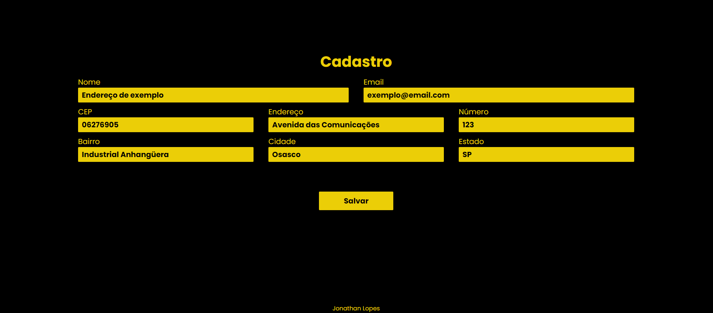

# Busca CEP

### Descrição
- Projeto simulando uma tela simples de cadastro.

### Objetivo
- Objetivo de consumir a API para obter o cep inserido no campo e preencher o restante dos campos de endereço automaticamente. Caso o CEP seja inválido, devolver um erro e limpar o formulário.

### API
- API utilizada foi a do viaCEP.

### Captura de tela

